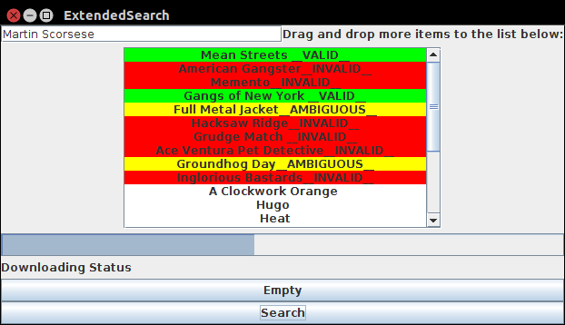

# ExtendedSearch
<h3>A Java based tool that demonstrates filtering of items in a list based on wikipedia knowledge(Wikipedia API)</h3>

This is a demonstration of what the android app does.

For example run:
<pre>
cd bin
java ExtendedSearch
</pre>

It shows a list of movies.You can also drag and drop your own list here from files or text.
 
Search which of these movies are Martin Scorsese directed?

</img>

It uses wikipedia API to extract information about every item in the list.

You can modify how searching is done in every response by implementing locations.InfoSearcher interface.
 
You can add your own target API other than Wikipedia by extending locations.Locations class.

